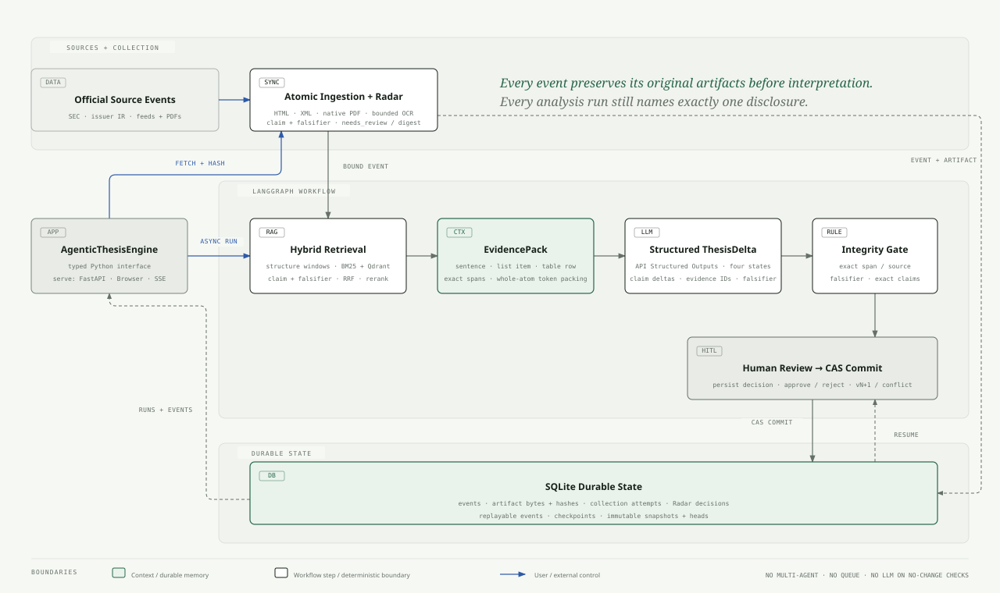

<h1 align="center">AgenticThesis</h1>

<p align="center">
  <a href="README.md">English</a> | <a href="README_ZH.md">简体中文</a>
</p>

<p align="center">
  <a href="https://www.python.org/downloads/"></a>
  <a href="https://pypi.org/project/agentic-thesis/"></a>
  <a href="https://github.com/langchain-ai/langgraph"></a>
  <a href="https://fastapi.tiangolo.com/"></a>
  <a href="LICENSE"></a>
  <a href="https://github.com/suvimatt/agentic-thesis/stargazers"></a>
</p>

<h2 align="center">Your investment thesis, evidence-guarded and versioned by AI</h2>

AgenticThesis is an open-source, stateful Python engine for monitoring how new company disclosures support, weaken, or invalidate an existing investment thesis. It keeps source-addressable evidence, reviewable changes, version history, and resumable workflow state application-owned.

> **Status: Alpha.** Public interfaces may change before 1.0.

The same Python distribution provides two entry points:

- `agentic-thesis serve` runs the self-hosted application with SQLite and embedded Qdrant;
- `AgenticThesisEngine` is the supported interface for Python applications.

For investors, the outcome is simple: remember why you invested and notice when new facts challenge those reasons.

AgenticThesis lets you write down:

- **why you believe the business is worth following or owning**;
- **what facts would prove each belief wrong**.

It checks official SEC filings each day. When a new filing appears, it compares the new facts with each reason in your company thesis, shows the exact supporting quotes, and asks you to review the proposed update. If nothing new appears, it does not spend money running an AI analysis.

You remain the decision-maker. AgenticThesis does not tell you to Buy, Sell, or Hold.

AgenticThesis is for self-directed, long-term investors who already have reasons for following or owning a small number of companies. It monitors the **company-fundamentals thesis** only. Stock valuation and the final investment action remain separate decisions owned by the investor.

## A concrete Apple example

The included Apple example produced these results in a recorded live API run:

| Your saved company-thesis reason | What the new filing showed | Plain-English result |
| --- | --- | --- |
| Services helps Apple maintain durable margins | Services gross margin was 73.9% versus 37.2% for Products, while Services sales grew 13% | **Still supported** |
| Greater China remains a resilient source of demand | Greater China sales fell 8%, mainly because of lower iPhone and iPad sales | **May no longer hold** |
| Apple can manage concentrated component supply | Apple still depends on some single or limited sources, but no current material disruption was established | **Weakened** |

Each result links back to the original filing passages. Nothing is added to your saved company thesis until you approve it.

## Table of Contents

- [A concrete Apple example](#a-concrete-apple-example)
- [🚀 Quick Start](#-quick-start)
- [Python Engine Interface](#python-engine-interface)
- [What AgenticThesis does for you](#what-agenticthesis-does-for-you)
- [Plain-English terms](#plain-english-terms)
- [How It Works](#how-it-works)
- [Architecture](#architecture)
- [Implemented Capabilities](#implemented-capabilities)
- [Verified Results](#verified-results)
- [API Usage](#api-usage)
- [90-Second Verification](#90-second-verification)
- [Deliberate Limits](#deliberate-limits)
- [License](#license)

## 🚀 Quick Start

### 1. Configure model endpoints

Create `~/.agentic-thesis/.env` (or use `.env` in the current directory):

```bash
mkdir -p ~/.agentic-thesis
$EDITOR ~/.agentic-thesis/.env
```

Set these values:

| Variable | Purpose |
| --- | --- |
| `OPENAI_API_KEY` | API key for reranking and structured thesis analysis |
| `OPENAI_BASE_URL` | OpenAI-compatible endpoint for the reasoning model |
| `AGENTIC_THESIS_MODEL` | Reasoning model name |
| `EMBEDDING_API_KEY` | API key for the embedding endpoint |
| `EMBEDDING_BASE_URL` | OpenAI-compatible embedding endpoint |
| `AGENTIC_THESIS_EMBEDDING_MODEL` | Embedding model name |
| `AGENTIC_THESIS_SEC_USER_AGENT` | Your product/name and contact email; required only for SEC monitoring |

SEC requires automated clients to identify themselves. For example:

```dotenv
AGENTIC_THESIS_SEC_USER_AGENT="AgenticThesis your-email@example.com"
```

### 2. Start the application

```bash
uvx agentic-thesis==0.7.0 serve
```

Open [http://127.0.0.1:8000](http://127.0.0.1:8000). The first start includes a ready-to-use Apple company thesis and two filings. Your company theses, source documents, vector index, checks, pending reviews, and approved updates remain under `~/.agentic-thesis/` after you close and restart the app.

Create another company thesis in the browser by entering the company, each reason you believe in the business, why it matters, and one fact that would prove it wrong. No JSON or schema knowledge is required.

For development and deterministic verification:

```bash
git clone https://github.com/suvimatt/agentic-thesis.git
cd agentic-thesis
python3 -m venv .venv
.venv/bin/python -m pip install -e '.[test]'
.venv/bin/pytest -q -p no:cacheprovider
```

The test suite uses deterministic retrieval and model substitutes where appropriate, so the core state guarantees can be verified without calling an external model.

## Python Engine Interface

Install the engine from PyPI:

```bash
python -m pip install "agentic-thesis==0.7.0"
```

`open_local` supplies the default SQLite checkpoint/state adapter and persistent embedded Qdrant index. Callers provide the model functions and use domain models exported from `agentic_thesis`:

```python
from agentic_thesis import AgenticThesisEngine, ReviewDecision

engine = await AgenticThesisEngine.open_local(
    "./data",
    embed=embed,
    rerank=rerank,
    analyze=analyze,
)
await engine.create_thesis(thesis)
await engine.add_disclosure(disclosure)
paused = await engine.run("aapl-2024-review", thesis.thesis_id)
committed = await engine.review(
    "aapl-2024-review", ReviewDecision(action="approve")
)
await engine.close()
```

The executable contract is [`tests/test_engine_contract.py`](tests/test_engine_contract.py). FastAPI, the browser application, SSE, and the local scheduler are self-host adapters around the same engine; they are not required by engine callers.

## What AgenticThesis does for you

| What usually goes wrong | What AgenticThesis does |
| --- | --- |
| Your original reasons get blurred by daily price moves and headlines | Keeps a dated history of what you believed |
| A 100-page filing is too long to compare with every company-thesis reason | Finds the passages relevant to each reason |
| An AI summary sounds confident but may not be grounded | Checks every quoted passage against the source |
| New evidence gets mixed with your final judgment | Proposes an update and waits for your approval |
| The app or computer restarts during research | Continues from saved progress |

The product is built for disciplined review, not trading signals. When evidence is missing or contradictory, it says **Not enough evidence** instead of forcing an answer.

## Plain-English terms

The code and engineering sections use precise internal names. In the product:

| Internal term | What it means to an investor |
| --- | --- |
| Investment thesis | Your saved reasons for following or owning a company |
| Claim | One specific reason you believe in the business |
| Falsifier | A fact that would prove that reason wrong |
| Thesis delta | A proposed evidence-based update |
| Human Review | You read the evidence and decide whether to save the update |

## How It Works

```text
Write down why you believe in the business and what would prove you wrong
→ AgenticThesis checks selected SEC reports once a day
→ No new filing: record the check and stop
→ New filing: compare its facts with every saved reason
→ Show Still supported / Weakened / May no longer hold / Not enough evidence
→ Link each result to the exact original quotes
→ Wait for you to keep your current view or save the update
```

Under the hood, these four results are stored as `supported`, `weakened`, `possibly_invalidated`, and `unknown`. The reviewable update is a typed `ThesisDelta`; an approved update becomes the next immutable `ThesisSnapshot` version.

## Architecture

[](docs/agentic-thesis-architecture.html)

The system has one application-owned workflow, not a collection of autonomous agents. LangGraph coordinates six explicit state transitions; deterministic code owns retrieval fusion, Context budgeting, citation integrity, and version commits, while the LLM is limited to conditional semantic reranking and structured thesis comparison.

| Boundary | Responsibility | Implementation |
| --- | --- | --- |
| Interface | Manage theses and disclosures, poll selected SEC filing types, start work asynchronously, replay progress, and accept review decisions | FastAPI, background `asyncio` tasks, durable SSE |
| Retrieval | Find claim-relevant passages across the filing corpus | deterministic section-labelled fixed-size chunks, BM25, embedded persistent Qdrant vectors, RRF, API rerank only when BM25/vector top-1 differ and top-3 overlap is below 2 |
| Working Context | Give each claim the smallest sufficient, source-addressable evidence | query-conditioned extractive `EvidencePack`, fixed 2,000-token per-claim budget, evidence IDs and source offsets |
| Semantic analysis | Compare every thesis claim with supplied evidence only | API Structured Outputs → typed `ThesisDelta` |
| Integrity gates | Prevent unsupported conclusions or unsafe state changes | quote/source validation, falsifier validation, exact-claim validation, Human Review |
| Durable state | Resume active or paused runs and preserve authoritative thesis history | LangGraph SQLite checkpoints, durable run events, immutable `ThesisSnapshot`s, thesis head |
| Commit | Apply an approved delta only if its base version is still current | SQLite compare-and-swap → `vN+1` or `version_conflict` |

The two checked-in SEC filings contain 97,675 `cl100k_base` tokens after deterministic HTML extraction. A model call never receives the full filings: it receives a per-claim, cited `EvidencePack`. This keeps **Context** (temporary working evidence), **Memory** (versioned thesis), and **Workflow State** (resumable execution) separate.

The editable diagram source is [`docs/agentic-thesis-architecture.html`](docs/agentic-thesis-architecture.html); the README renders its exported SVG.

## Implemented Capabilities

- deterministic SEC HTML extraction, fixed-size chunks with section metadata, character offsets, and stable chunk IDs;
- BM25 + persistent Qdrant local vector retrieval and Reciprocal Rank Fusion; only new chunks are embedded, with listwise API reranking only when BM25/vector top-1 differ and top-3 overlap is below 2;
- extractive Context compression with a hard token budget, source coverage, and retained evidence IDs;
- OpenAI Structured Outputs for the four-state `ThesisDelta` contract;
- quote-to-source citation validation; unsupported output is downgraded to `unknown`;
- a six-node LangGraph with Human Review interrupt and SQLite checkpoint/resume;
- immutable thesis snapshots and compare-and-swap conflict protection;
- persistent run history and sequenced SSE replay with `Last-Event-ID` across browser or service restarts;
- multiple isolated theses plus manual HTML/TXT disclosure import;
- one official-source SEC EDGAR monitor per thesis, selected filing types, accession/content deduplication, manual sync, and a persisted daily collection schedule;
- async FastAPI, background runs, bounded/timeout-wrapped model calls, checkpoint recovery after shutdown, and live LangGraph events without chain-of-thought;
- a dependency-free product page with a guided investment-case editor, disclosure management, progress, citations, Context compression, and Human Review;
- an installable `agentic-thesis serve` CLI with packaged sample data and a stable user data directory.

## Verified Results

Observed on the checked-in fixtures on 2026-09-02:

| Check | Observed result |
| --- | ---: |
| Tests | 17 passed |
| Clean wheel install | passed outside the repository |
| 2023 extracted tokens / chunks | 48,923 / 109 |
| 2024 extracted tokens / chunks | 48,752 / 110 |
| Categorized gold queries | 26: 15 calibration / 11 held-out |
| BM25 / fake-vector / hybrid Recall@5 | 0.846 / 0.538 / 0.769 |
| Always-rerank / conditional-rerank Recall@5 | 0.885 / 0.846 |
| BM25 / vector / hybrid / always / conditional MRR | 0.581 / 0.369 / 0.544 / 0.663 / 0.635 |
| Conditional rerank calls | 15 / 26 |
| Held-out conditional Recall@5 / MRR | 1.00 / 0.652 |
| Forged citation | downgraded to `unknown` |
| Restart/resume | committed v2 from the same run ID |
| Stale version | rejected with `version_conflict` / HTTP 409 |

The 26 cases in `evals/gold.json` cover lexical, numeric, semantic, risk, and regulatory questions across both filings. Deterministic vector and rerank substitutes make the ablation reproducible without an external model; they verify policy behavior and metric calculation, not model quality.

The checked-in `evals/live_results.json` preserves the earlier real five-query API run over both filings (219 chunks) using `qwen3.7-text-embedding` and `gpt-5.6-luna`:

| Live check | Observed result |
| --- | ---: |
| BM25 / vector / hybrid / rerank Recall@5 | 1.00 / 0.80 / 1.00 / 1.00 |
| Gold positions, hybrid → rerank | 2→2, 1→1, 2→2, 4→5, 3→3 |
| Gold evidence retained after compression | 5 / 5 |
| Validated claim statuses | supported / possibly_invalidated / weakened |
| Embedding index | 8.73 s |
| Five-query rerank evaluation | 38.17 s |
| Three-claim structured analysis | 16.18 s |

The earlier reranker preserved Recall@5 but did not improve gold position; one case moved from rank 4 to rank 5. The 26-query live rerun has not been recorded, so the current v0.5 comparison is limited to the reproducible deterministic ablation. These timings are one measured historical run, not a latency benchmark or production SLO.

Run the live embedding, rerank, Context compression, and Structured Outputs evaluation with:

```bash
.venv/bin/python evals/run_live.py
```

The measured report is written to `evals/live_results.json`; it never contains the API key.

## API Usage

Start and review a run through the API:

```bash
curl -X POST http://localhost:8000/runs \
  -H 'content-type: application/json' \
  -d '{"run_id":"aapl-2024-review","thesis_id":"aapl-primary"}'

curl -N http://localhost:8000/runs/aapl-2024-review/events

curl -X POST http://localhost:8000/runs/aapl-2024-review/review \
  -H 'content-type: application/json' \
  -d '{"action":"approve"}'
```

Configure and check an SEC monitor:

```bash
curl -X PUT http://localhost:8000/theses/aapl-primary/monitor \
  -H 'content-type: application/json' \
  -d '{"cik":"320193","forms":["10-K","10-Q","8-K"],"enabled":true}'

curl -X POST http://localhost:8000/theses/aapl-primary/sync
```

The first successful check imports only the latest selected filing, establishing a cursor without historical backfill. The service checks whether collection is due when it starts and then hourly while running. Automatic SEC collection occurs only when the last successful collection is at least 24 hours old; “Check SEC now” remains a manual override. A failed collection does not advance that timestamp and is retried on the next hourly check. No new filing means no RAG or LLM run; new filings start a `ThesisDelta` workflow that still stops at Human Review.

The browser can also create/list theses, import/list disclosures, list historical runs, and reopen pending reviews. The generated `/docs` page documents the same HTTP API.

## 90-Second Verification

Use the product page for the normal filing → evidence → review path. Then run the single deterministic scenario that proves the two state guarantees that are awkward to stage manually:

```bash
.venv/bin/pytest -vv -p no:cacheprovider \
  tests/test_mvp.py::test_langgraph_resumes_after_restart_and_rejects_stale_commit
```

That scenario pauses a run at Human Review, closes and recreates the workflow on the same SQLite database, resumes the same run ID into Thesis v2, then advances the authoritative head while another run is paused and verifies that its stale approval returns HTTP 409. It uses deterministic fake retrieval and analysis, so it does not call an external model.

## Deliberate limits

- automatic ingestion is intentionally limited to official SEC EDGAR submissions; no news, social media, or investor-relations crawlers;
- the scheduler is one in-process `asyncio` loop that checks due state hourly and automatically performs successful SEC collection at most once per 24 hours; it is not a distributed job system or notification service;
- Qdrant runs embedded and persists vectors under the user data directory; SQLite persists workflow and thesis state;
- no portfolio management, valuation, Multi-Agent roles, distributed scheduler, or queue;
- the gold set contains 26 Apple questions across two filings; a second issuer and a current 26-query live API result are still missing;
- no measured throughput, p50, p95, or production-readiness claim.

## License

AgenticThesis is licensed under the [GNU Affero General Public License v3.0](LICENSE).
